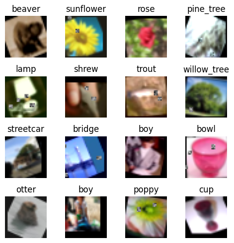

# 22-67-neural-networks

- [22-67-neural-networks](#22-67-neural-networks)
  - [Descripción](#descripción)
    - [TP1 - Clasificador de Texto](#tp1---clasificador-de-texto)
    - [TP2 - CIFAR100 Challenge (MLP)](#tp2---cifar100-challenge-mlp)
      - [Consigna](#consigna)
      - [Implementación](#implementación)
        - [Modelo](#modelo)
      - [Resultados](#resultados)
      - [Links](#links)
    - [TP3 - CIFAR100 Challenge (CNN)](#tp3---cifar100-challenge-cnn)
      - [Consigna](#consigna-1)
      - [Implementación](#implementación-1)
      - [Data augmentation](#data-augmentation)
        - [Modelo](#modelo-1)
      - [Resultados](#resultados-1)
      - [Links](#links-1)
    - [TP4 - Clasificador de Texto (CNN)](#tp4---clasificador-de-texto-cnn)

## Descripción

Repositorio para los Trabajos Prácticos y afines de la materia *22.67 - Redes Neuronales* de la carrera Ingeniería Electrónica del Instituto Tecnológico Buenos Aires (ITBA).

### TP1 - Clasificador de Texto

### TP2 - CIFAR100 Challenge (MLP)

#### Consigna

#### Implementación

##### Modelo

model: "sequential"

| Layer (type)               | Output Shape   | Param #      |
|----------------------------|----------------|--------------|
| dense (Dense)           | (None, 1024)   | 3,146,752    |
| activation (Activation) | (None, 1024)   | 0            |
| dense_1 (Dense)           | (None, 512)    | 524,800      |
| activation_1 (Activation) | (None, 512)    | 0            |
| dense_2 (Dense)           | (None, 100)    | 51,300       |
| activation_2 (Activation) | (None, 100)    | 0            |

**Total params:** 3,722,852 (14.20 MB)  
**Trainable params:** 3,722,852 (14.20 MB)  
**Non-trainable params:** 0 (0.00 B)

#### Resultados

* Train loss: 2.870164155960083
* Train acc: 0.3100999891757965
* Val loss: 3.2455174922943115
* Val acc: 0.23749999701976776

#### Links

[nbviewer (last commit)](https://nbviewer.org/github/alheir/22-67-neural-networks/blob/main/tp_02_cifar100_mlp.ipynb)

Carlos Selmo. (2024). ITBA - CIFAR 100 - 2024Q1. Kaggle. [https://kaggle.com/competitions/itba-cifar-100-2024-q-1](https://kaggle.com/competitions/itba-cifar-100-2024-q-1)

### TP3 - CIFAR100 Challenge (CNN)

#### Consigna

#### Implementación

#### Data augmentation

Se aplica una secuencia de transformaciones al dataset original con el fin de aumentar el dataset efectivo con el que se entrena el modelo. De un dataset inicial de 50k imágenes, aplicando las transformaciones 4 veces, se arma una dataset final de 250 imágenes, incluyendo las originales sin modificaciones.

Dichas transformaciones, aplicadas en orden aleatorio, son la siguientes:

1. Flip horizontal
2. Rotación aleatoria entre -25° y 25°
3. Entre 2 y 5 de los siguientes efectos, aplicados en orden aleatorio:
   1. Traslación en X, entre -5px y 5px
   2. Traslación en Y, entre -5px y 5px
   3. Escalamiento en X e Y, entre .9 y 1.1
   4. Crop and pad: recorte y relleno de entre -2px y 2px en cualquier borde.
   5. Suma entre -.15 y .15 a cada píxel (escalados de 0.0 a 1.0), aplicado por canal con p = .5
   6. Multiplicación entre .95 y 1.15 a cada píxel (escalados de 0.0 a 1.0), aplicado por canal con p = .5
   7. Factor de contraste, entre .8 y 1.4
   8. Relleno random con rectángulos de ruido gaussiano; entre 1 y 4, cada uno del 10% del tamañao de la imagen.

##### Modelo

model: "sequential"

| Layer (type)                    | Output Shape        | Param #      |
|---------------------------------|---------------------|--------------|
| conv2d (Conv2D)                 | (None, 32, 32, 128) | 3,584        |
| batch_normalization             | (None, 32, 32, 128) | 512          |
| (BatchNormalization)            |                     |              |
| conv2d_1 (Conv2D)               | (None, 32, 32, 128) | 147,584      |
| batch_normalization_1           | (None, 32, 32, 128) | 512          |
| (BatchNormalization)            |                     |              |
| max_pooling2d (MaxPooling2D)    | (None, 16, 16, 128) | 0            |
| dropout (Dropout)               | (None, 16, 16, 128) | 0            |
| conv2d_2 (Conv2D)               | (None, 16, 16, 256) | 295,168      |
| batch_normalization_2           | (None, 16, 16, 256) | 1,024        |
| (BatchNormalization)            |                     |              |
| conv2d_3 (Conv2D)               | (None, 16, 16, 256) | 590,080      |
| batch_normalization_3           | (None, 16, 16, 256) | 1,024        |
| (BatchNormalization)            |                     |              |
| max_pooling2d_1 (MaxPooling2D)  | (None, 8, 8, 256)   | 0            |
| dropout_1 (Dropout)             | (None, 8, 8, 256)   | 0            |
| conv2d_4 (Conv2D)               | (None, 8, 8, 512)   | 1,180,160    |
| batch_normalization_4           | (None, 8, 8, 512)   | 2,048        |
| (BatchNormalization)            |                     |              |
| conv2d_5 (Conv2D)               | (None, 8, 8, 512)   | 2,359,808    |
| batch_normalization_5           | (None, 8, 8, 512)   | 2,048        |
| (BatchNormalization)            |                     |              |
| max_pooling2d_2 (MaxPooling2D)  | (None, 4, 4, 512)   | 0            |
| dropout_2 (Dropout)             | (None, 4, 4, 512)   | 0            |
| flatten (Flatten)               | (None, 8192)        | 0            |
| dense (Dense)                   | (None, 1024)        | 8,389,632    |
| dropout_3 (Dropout)             | (None, 1024)        | 0            |
| dense_1 (Dense)                 | (None, 512)         | 524,800      |
| dropout_4 (Dropout)             | (None, 512)         | 0            |
| dense_2 (Dense)                 | (None, 100)         | 51,300       |

**Total params:** 13,549,284 (51.69 MB)  
**Trainable params:** 13,545,700 (51.67 MB)  
**Non-trainable params:** 3,584 (14.00 KB)

#### Resultados

* Train loss: 0.1687
* Train acc: 0.9463
* Val loss: 0.7888
* Val acc: 0.8052

#### Links

[nbviewer (last commit)](https://nbviewer.org/github/alheir/22-67-neural-networks/blob/main/tp_02_cifar100_cnn.ipynb)

Carlos Selmo. (2024). ITBA - CIFAR 100 - 2024Q1. Kaggle. [https://kaggle.com/competitions/itba-cifar-100-2024-q-1](https://kaggle.com/competitions/itba-cifar-100-2024-q-1)

### TP4 - Clasificador de Texto (CNN)
  

